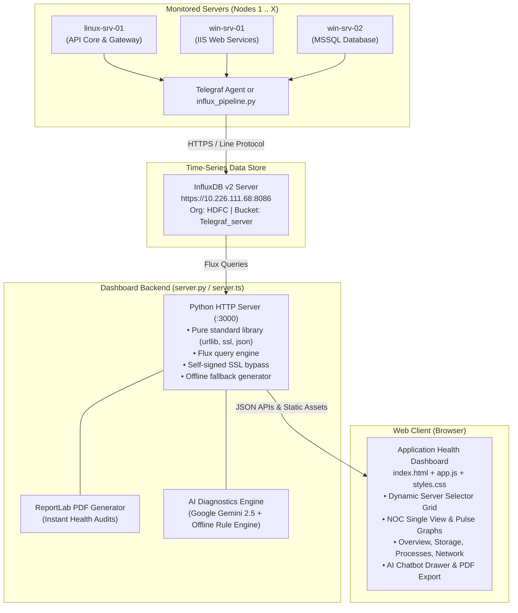

# 🖥️ Enterprise Application & Cluster Health Dashboard

> **A mission-critical, air-gapped infrastructure monitoring dashboard and AI-powered SRE command center.**  
> Built for enterprise environments, banking clusters, and secure networks to monitor multi-node telemetry (Linux & Windows) in real time with InfluxDB, Telegraf, automated root-cause diagnostics via Google Gemini AI, and executive PDF reporting.

---

[](#)
[](#)
[](#)
[](#)
[](#)
[](#)

---

## 📑 Table of Contents

1. [What is this Project?](#-what-is-this-project)
2. [Key Features](#-key-features)
3. [System Architecture](#-system-architecture)
4. [Quick Start Guide (Run in 30 Seconds)](#-quick-start-guide-run-in-30-seconds)
   - [Method 1: Instant Python Standard Library (Zero Dependencies)](#method-1-instant-python-standard-library-recommended--zero-dependencies)
   - [Method 2: Node.js & Vite Developer Setup](#method-2-nodejs--vite-developer-setup)
5. [Configuration & Environment Variables](#-configuration--environment-variables)
6. [UI Overview & Navigation](#-ui-overview--navigation)
   - [Top Executive Command Bar](#1-top-executive-command-bar)
   - [Monitored Nodes Grid & Stretch Controls](#2-monitored-nodes-grid--card-stretch-controls)
   - [Full-Page Deep Telemetry Inspection View](#3-full-page-deep-telemetry-inspection-view)
   - [AI Health Assistant & Automated SRE Diagnostics](#4-ai-health-assistant--automated-sre-diagnostics)
   - [Executive PDF Health Audit Export](#5-executive-pdf-health-audit-export)
7. [Telemetry Ingestion Pipeline (`influx_pipeline.py`)](#-telemetry-ingestion-pipeline)
8. [Airgap & Offline Enterprise Deployment](#-airgap--offline-enterprise-deployment)
9. [API Endpoints Reference](#-api-endpoints-reference)
10. [Project Directory Structure](#-project-directory-structure)
11. [Troubleshooting & FAQ](#-troubleshooting--faq)

---

## 💡 What is this Project?

In large enterprise IT systems, banking environments, and government agencies, servers frequently run in **air-gapped environments** (completely cut off from the public internet for security). System reliability engineers (SREs) and system administrators face two common bottlenecks:
1. **Tooling often requires internet access, cloud agents, or complex third-party stacks** that cannot be deployed into isolated data centers.
2. **Alert fatigue & fragmented data**: Operators have to juggle multiple consoles across Linux and Windows servers, calculate utilization metrics manually, and write incident reports by hand.

**This Application Health Dashboard solves both problems:**
- **Runs anywhere with 0 mandatory pip installs or npm builds** using standard Python 3 and pure browser technologies.
- **Aggregates real-time server telemetry** (CPU, RAM, Disk, Swap, Mounts, Processes, and Network interfaces) into a unified single-screen NOC view.
- **Includes an AI Health Assistant** powered by Google Gemini (with an automatic offline rule engine fallback) that diagnoses infrastructure anomalies and threshold violations in natural language.
- **Generates instant, signed Executive Health Audit PDF reports** with a single click.

---

## ✨ Key Features

| Feature | Description |
|---|---|
| 🛡️ **100% Air-Gap Verified** | Operates in networks with zero internet connectivity. Uses self-contained SVG graphics, native fonts, and built-in Python standard libraries (`http.server`, `urllib`, `ssl`, `json`, `csv`). |
| 🖥️ **Multi-Node Monitoring (X Servers)** | Dynamically discovers and monitors any number of servers (configured by default for 1 Linux and 2 Windows nodes, scales seamlessly to 10+). |
| 🎛️ **Interactive Card Resizing & Stretch** | Click and drag any card's corner or edge to stretch or minimize it. Switch between **AUTO**, **3**, **2**, and **1** column layouts on the fly. |
| 🔍 **Full-Page Deep Telemetry Inspector** | Inspect any node in detail with 2 view modes (**NOC Single View** & **Pulse Graphs**) and 4 subtabs: **Overview**, **Storage**, **Processes**, and **Network**. |
| 🤖 **AI Health Assistant (Gemini + Offline SRE)** | Integrated with Google Gemini 2.5 Flash / Pro to diagnose high load, memory leaks, and disk bottlenecks. Automatically falls back to an offline heuristic engine if no internet/API key is present. |
| 📄 **Executive PDF Health Audit Report** | Generates downloadable, formatted PDF audits summarizing cluster status, memory consumption, disk health, and risk factors. |
| 📈 **Real-Time Glossy Wave Sparklines** | Custom SVG spline curves rendering high-frequency metric trends with hover tooltips and 80% alert threshold indicators. |
| 🌓 **Dual Cyber Theming** | Switch seamlessly between **Cyber Carbon Dark Mode** (deep black, neon cyan/emerald accents) and **Crystal Frosted Glass Light Mode** (high contrast, crisp typography). |
| ⏱️ **Flexible Time Windowing** | Switch query timeframes instantly across **1H**, **2H**, **12H**, and **24H** without page reloading. |
| 🔌 **Self-Signed Enterprise SSL Support** | Communicates with private corporate InfluxDB instances (`https://10.226.111.68:8086`) even with internal self-signed TLS certificates. |

---

## 🏗️ System Architecture



---

## 🚀 Quick Start Guide (Run in 30 Seconds)

### Method 1: Instant Python Standard Library (Recommended & Zero Dependencies)

> **No `npm`, no `pip install`, and no internet required!** Standard Python 3 is all you need.

1. Open your terminal in the project directory:
   ```bash
   cd D:\Hackathon-Dashboard
   ```

2. Start the dashboard server:
   ```bash
   # On Windows:
   python server.py

   # On Linux / macOS:
   python3 server.py
   ```

3. Open your browser to:
   ```
   http://localhost:3000
   ```

*The dashboard will automatically start, detect your environment, connect to InfluxDB if available (or use realistic offline simulation data if InfluxDB is offline), and serve the complete command center.*

---

### Method 2: Node.js & Vite Developer Setup

If you are developing or customizing the frontend with live Hot Module Replacement (HMR):

1. **Install dependencies:**
   ```bash
   npm install
   ```

2. **Configure your `.env`:**
   Copy `.env.example` to `.env` and fill in your credentials.

3. **Start the development server:**
   ```bash
   npm run dev
   ```

4. Open your browser at `http://localhost:3000`.

---

## ⚙️ Configuration & Environment Variables

The server automatically reads configuration from `.env` in the project root. If `.env` is absent, standard enterprise defaults configured in `server.py` are used.

| Variable | Description | Default / Example Value |
|---|---|---|
| `INFLUX_URL` | URL of your InfluxDB v2 instance | `https://10.226.111.68:8086` |
| `INFLUX_TOKEN` | API access token with read permissions | *(configured secure token)* |
| `INFLUX_ORG` | Organization name or Org ID in InfluxDB | `HDFC` |
| `INFLUX_BUCKET` | InfluxDB bucket storing Telegraf metrics | `Telegraf_server` |
| `GEMINI_API_KEY` | Google AI Studio Gemini API Key | *(Optional - can be entered in UI)* |
| `AI_MODEL` | Gemini AI model version | `gemini-2.5-flash` |
| `AI_PROVIDER` | AI provider choice (`google`, `offline`) | `google` |

> [!TIP]
> You don't have to restart the server to change the Gemini API key! Click the **AI CHATBOT** button in the top bar, click the **API KEY** pill, enter your key, and click **SAVE**.

---

## 🖥️ UI Overview & Navigation

### 1. Top Executive Command Bar
- **Cluster Summary**: Displays the total count of monitored nodes (e.g., `3 NODES MONITORED: 1 Linux Server • 2 Windows Servers`).
- **Connection Status Badge**: Shows live connection state to InfluxDB with instant color status (Green = Connected, Amber = Simulating/Offline).
- **Precision UTC Clock**: Live digital clock displaying accurate UTC time.
- **Time Range Selector**: Toggle between `1H`, `2H`, `12H`, and `24H` telemetry history.
- **Theme Toggle**: Switch between **Dark Cyber Mode** (🌙) and **Crystal Light Mode** (☀️).
- **Refresh**: Manually trigger an instant query to InfluxDB.
- **AI Chatbot**: Opens the slide-over AI Health Assistant drawer.

---

### 2. Monitored Nodes Grid & Card Stretch Controls
- **Filter Tabs**: Filter the visible nodes by `ALL (3)`, `LINUX (1)`, or `WINDOWS (2)`.
- **Column View**: Switch grid between `AUTO`, `3`, `2`, or `1` column layouts.
- **Interactive Card Stretching**: Click and drag the bottom or bottom-right corner of any server card to expand or minimize its view.
- **Server Health Metrics**:
  - Live Status Pulse (`HEALTHY` or `ALERT`).
  - Real-time gauge metrics for **CPU %**, **Memory %**, **Disk %**, and **Swap %**.
  - Interactive SVG Sparkline showing recent trend curves.
  - **INSPECT NODE** button to launch the full-page deep-dive modal.

---

### 3. Full-Page Deep Telemetry Inspection View
Clicking **INSPECT NODE** on any server opens the comprehensive full-page command center:

```
┌────────────────────────────────────────────────────────────────────────┐
│  linux-srv-01 [OPERATIONAL]          [1H] [2H] [12H] [24H] [PDF REPORT] │
├────────────────────────────────────────────────────────────────────────┤
│  [ NOC SINGLE VIEW ]  |  [ PULSE GRAPHS ]                              │
│  Tabs: [ OVERVIEW ]  [ STORAGE ]  [ PROCESSES ]  [ NETWORK ]           │
├───────────────────────────────────┬────────────────────────────────────┤
│  REAL-TIME TELEMETRY STREAM       │  SUBTAB CONTENT                    │
│  • Glossy Wave SVG graph          │  • Overview: 4 KPI Cards + Gauge   │
│  • Threshold line (80% Alert)     │  • Storage: Mounts & Free Space    │
│  • Hover tooltips with timestamps │  • Processes: Top CPU/RAM tasks    │
│  • Real-time high/avg/low values  │  • Network: RX/TX Interfaces       │
└───────────────────────────────────┴────────────────────────────────────┘
```

- **NOC Single View**: Split-screen view with the high-resolution telemetry graph on the left and selected subtab diagnostics on the right.
- **Pulse Graphs**: Multi-stream infrastructure pulse charts comparing CPU, RAM, Disk, and Swap simultaneously.
- **Subtabs**:
  - **Overview**: Circular overall health score, memory distribution (Used, Active, Free, Cached), and file system summary.
  - **Storage**: Individual disk partitions, mount paths (`/`, `/var`, `C:\`, `D:\`), used vs. total capacity, and percentage bars.
  - **Processes**: Live process list with PID, process name, owner, CPU%, and Memory%.
  - **Network**: Active network adapters, IP addresses, packet error rates, and live RX/TX throughput.

---

### 4. AI Health Assistant & Automated SRE Diagnostics
Click the **AI CHATBOT** button to open the assistant. It automatically binds the live telemetry of all cluster nodes into its context:

- **Quick Action Prompts**:
  - `🔍 Analyze Health Check`: Performs an instant automated multi-node audit and highlights bottlenecks.
  - `⚠️ Check Bottlenecks`: Scans for any metric exceeding 80% thresholds.
  - `⚡ Live Telegraf Snapshot`: Generates a quick text summary of current resource consumption.
  - `📄 Download Health Report (PDF)`: Triggers the PDF export.
- **AI Models Supported**:
  - `gemini-2.5-flash` (Fast, recommended)
  - `gemini-2.5-pro` (Deep reasoning & incident post-mortems)
  - `gemini-1.5-flash` & `gemini-1.5-pro`
  - `Airgap Telemetry Engine` (Offline heuristic engine that requires no internet or API key)

---

### 5. Executive PDF Health Audit Export
Click **PDF REPORT** from the top bar, inspect view, or chatbot drawer. The server dynamically compiles an executive-ready PDF report including:
- Official cluster status badge and audit timestamp.
- Node-by-node telemetry scorecard (CPU, RAM, Disk, Swap).
- High-utilization alerts and threshold violations (>80%).
- System uptime, kernel versions, and IP allocations.
- Formal SRE signature line and sign-off section.

---

## 📡 Telemetry Ingestion Pipeline

If you want to stream real system metrics from any server to your InfluxDB bucket:

1. Install pipeline requirements:
   ```bash
   pip install influxdb-client psutil python-dotenv
   ```
2. Run the ingestion script on the target machine:
   ```bash
   python influx_pipeline.py
   ```
This script queries the local operating system via `psutil` every second and pushes formatted Line Protocol data points to InfluxDB (`system` and standard `telegraf` measurements).

---

## 📦 Airgap & Offline Enterprise Deployment

To transfer and run this application on a secure machine with **zero internet connection**:

### Step 1: Prepare the Bundle (on an internet-connected machine)
```bash
# On Windows:
prepare_airgap_transfer.bat

# On Linux / macOS:
./prepare_airgap_transfer.sh
```
This runs `download_packages.bat` / `sh` to cache any optional Python wheel packages into `./offline_packages`.

### Step 2: Transfer Files
Copy the entire `Hackathon-Dashboard` folder to a USB drive or approved enterprise transfer media, and paste it onto your air-gapped target machine.

### Step 3: Run on Air-Gapped Target
```bash
# Optional: Install cached offline wheels if you wish to use reportlab/psutil
install_offline.bat   # (or ./install_offline.sh on Linux)

# Launch the server (Zero pip packages required for core dashboard)
python server.py
```
Open `http://localhost:3000` in any modern web browser.

---

## 🔌 API Endpoints Reference

The built-in server provides REST APIs used by the frontend:

| Method | Endpoint | Description | Query / Body Parameters |
|---|---|---|---|
| `GET` | `/api/status` | Discovers cluster nodes and checks InfluxDB connectivity | `None` |
| `GET` | `/api/metrics` | Fetches historical time-series metrics for cards & charts | `range=1h\|2h\|12h\|24h`, `host=<hostname>`, `limit=3` |
| `GET` | `/api/models` | Lists available AI diagnostic models & API key status | `None` |
| `POST` | `/api/chat` | AI Health Assistant chat endpoint | `{"message": "...", "model": "...", "apiKey": "..."}` |
| `GET` / `POST` | `/api/health-report-pdf` | Generates and downloads the executive PDF audit report | Optional custom telemetry JSON body |

---

## 📂 Project Directory Structure

```
D:\Hackathon-Dashboard\
├── index.html                 # Main Single-Screen Command Center HTML
├── app.js                     # Core frontend engine (dynamic cards, SVG graphs, AI drawer)
├── styles.css                 # Cyber Dark & Crystal Light stylesheets
├── server.py                  # Standalone Python backend (InfluxDB client, AI, PDF generator)
├── server.ts                  # Alternative TypeScript / Express backend
├── influx_pipeline.py         # System metric ingestion pipeline to InfluxDB
├── .env.example               # Template for environment variables
├── requirements.txt           # Python package requirements
├── package.json               # Node.js dependencies (Vite, React, Tailwind)
├── download_packages.bat/.sh  # Caches offline Python wheels for airgap use
├── install_offline.bat/.sh    # Installs cached wheels without internet
├── prepare_airgap_transfer.*  # One-click packaging for airgap deployment
└── README.md                  # Comprehensive project documentation
```

---

## ❓ Troubleshooting & FAQ

### Q1: What happens if InfluxDB is offline or unreachable?
**A:** The dashboard includes an intelligent **Airgap Telemetry Engine**. If `https://10.226.111.68:8086` is not reachable, the server automatically serves realistic, continuous telemetry streams for 3 nodes (1 Linux, 2 Windows). You can test, present, and demo the entire UI, inspect modal, graphs, and chatbot without a live InfluxDB connection!

### Q2: What if I don't have a Google Gemini API Key?
**A:** The AI Chatbot has a built-in **Airgap Telemetry Engine**. If no Gemini key is provided, the chatbot uses local heuristic SRE algorithms to inspect live metrics, detect CPU/RAM bottlenecks, and answer your health check questions offline.

### Q3: How do I monitor more than 3 servers?
**A:** The dashboard dynamically discovers hosts from InfluxDB. If your InfluxDB bucket receives data from 10 or 20 servers, the dashboard automatically detects them and scales the top selector grid accordingly.

### Q4: Port 3000 is already in use on my machine. How do I change it?
**A:** In `server.py`, change line 16:
```python
PORT = 8080   # Or any available port
```
Then run `python server.py` and open `http://localhost:8080`.

### Q5: Does the dashboard work with self-signed SSL certificates?
**A:** Yes. `server.py` uses a custom SSL context with certificate verification disabled (`ssl.CERT_NONE`), specifically configured for private enterprise data center IP addresses like `https://10.226.111.68:8086`.

---

<div align="center">
  <sub>Built for Enterprise SREs, Mission-Critical Clusters & Cyber Fintech Operations.</sub>
</div>
# Server-Health-Dashboard

# Server-Health-Dashboard

